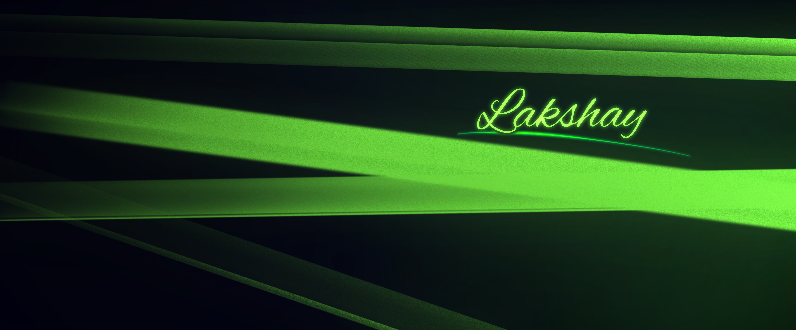

# Hello, I'm Lakshay Chawla 👋

I'm a Data Scientist intrigued by the possibilities of transforming our brains with AI.

## 📚 Education

- Master of Technology (Artificial Intelligence)**
  Indian Institute of Technology, IIT, Jodhpur (01/2025 - Present)
- **Bachelor of Technology (Computer Science Engineering)**
  Maharaja Agrasen Institute of Technology (08/2018 - 06/2022, 8.6 CGPA)

## 🌟 Professional Highlights
- **R&D Consultant at System 3** (01/2024 - Present): Developing ML and AI course content, and leveraging data insights for strategic decision-making.
- **Researcher at StellarDNN** (01/2023 - Present): Focusing on developing advanced architectures for Physics-Informed Neural Networks (PINNs).
- **Research Fellow(Computer Science) at Harvard SEAS** (05/2024-07/2024): Focused on developing new methods for localization for Physics-Informed Neural Networks (PINNs).

## 🔭 Current Projects
- [NeuroDiffHub](http://dev.neurodiff.io): A platform to save all your PINNs solvers.
- Applications of PINNs: Physics Informed Neural Networks.
- Spectral Analysis of crops.

## 📈 GitHub Stats

## 🚀 Skills
- Physics Informed Neural Networks(PINNs)
- Machine Learning and Artificial Intelligence
- Data Science
- Python
- Hive
- Hadoop
- SQL
  
## 📫 How to Reach Me
- [LinkedIn](https://www.linkedin.com/in/lakshaychawla13)
- [Email](mailto:lakshaychawla13@gmail.com)

## ⚡ Fun Fact
I have interests in behavioural economics, strategic gaming, and clinical psychology. Also, I enjoy writing and music.
