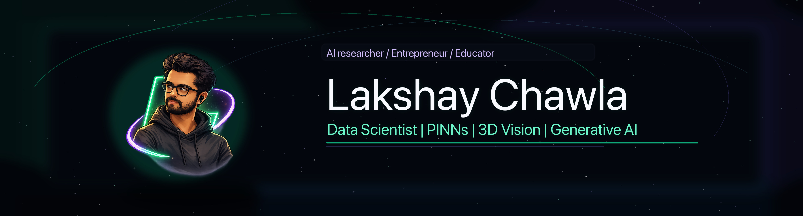

  

  
  
  
  

## About

I am currently pursuing an M.Tech. in Artificial Intelligence at IIT Jodhpur, where I work with CLARITY Lab on physically grounded AI systems. My recent work spans PINNs, 3D vision, 3D generation, agentic LLM systems, and applied AI product development.

- **Research focus:** Physics-Informed Neural Networks (PINNs), 3D vision, 3D generation, and AI systems with stronger physical grounding.
- **Collaboration focus:** Freelance AI/ML development, custom software, and research-led prototyping.
- **Background:** Research experience across Harvard SEAS, StellarDNN, System 3, Univ.AI, and IIT Jodhpur.

## Experience

- **Freelance AI/ML Developer** at Self-Employed `(06/2025 - Present)`
- **Researcher** at CLARITY Lab, IIT Jodhpur `(01/2025 - Present)`
- **R&D Consultant** at System 3 `(01/2024 - 05/2025)`
- **Research Fellow (Computer Science)** at Harvard SEAS `(05/2024 - 07/2024)`
- **Researcher** at StellarDNN `(01/2023 - 08/2024)`
- **Learning Experience Supervisor + Analytics Consultant** at Univ.AI `(05/2022 - 12/2023)`

## Highlighted Projects

- **[FREN Bot](https://lakshay-13.github.io/fren/):** AI-powered Discord bot with chat, meme generation, moderation, games, and custom workflows.
- **[ArtGridX](https://artgridx.nextgenaischool.in/):** Project landing page for ArtGridX.
- **[NotifyMe](https://lakshay-13.github.io/notifyme/):** Android push-notification receiver built with Kotlin, Jetpack Compose, FCM, managed device API keys, in-app API docs, and automatic website-hosted updates.
- **[URL Extractor](https://url.nextgenaischool.in/):** Project landing page for URL Extractor.
- **[Zinging](https://lakshay-13.github.io/zinging/):** Discord music bot with queue controls, library browsing, and recommendation flows.
- **[Fren Shop](https://www.nextgenaischool.in/fren):** Official support and commerce hub for FREN with premium drops, updates, and community tooling.
- **[RL-PINNs](https://lakshay-13.github.io/rl-pinn/):** Reinforcement-learning framework for more adaptive and interactive PINN training.

  

## Skills

- **AI/ML:** PINNs, 3D Vision, 3D Generative Modeling, LLMs, Agentic Systems, RAG, Computer Vision
- **Programming:** Python, PyTorch, TensorFlow, SQL, LangChain, LangGraph, OpenAI API
- **Data:** Hive, Hadoop, Spark, Exploratory Data Analysis, Data Visualization

## Education

- **Master of Technology (Artificial Intelligence)**, IIT Jodhpur `(01/2025 - Present)`
- **Bachelor of Technology (Computer Science Engineering)**, Maharaja Agrasen Institute of Technology `(08/2018 - 06/2022, 8.6 CGPA)`

## Contact

- **Email:** [lakshaychawla13@gmail.com](mailto:lakshaychawla13@gmail.com)
- **LinkedIn:** [linkedin.com/in/lakshaychawla13](https://www.linkedin.com/in/lakshaychawla13)
- **Portfolio:** [lakshay-13.github.io](https://lakshay-13.github.io)
