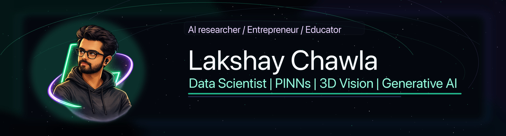

  

  
  
  
  

## About

I am a data scientist building AI at the intersection of Physics-Informed Neural Networks, 3D vision, agentic systems, product infrastructure, and AI education.

- Research, products, education, and open-source work are connected by the same goal: make AI systems useful, grounded, and accessible.
- My research focuses on Physics-Informed Neural Networks, 3D vision/generation, and physically grounded intelligence. I started my research journey at Harvard SEAS and currently work with [CLARITY Lab, IIT Jodhpur](https://home.iitj.ac.in/~hardikjain/clarityLab.html).
- I am also building AI education products, developer tools, and applied AI systems across the [NextGenAISchool](https://www.nextgenaischool.in/) ecosystem.

## Experience

- **CEO** at [NextGenAISchool](https://www.nextgenaischool.in/) `(05/2026 - Present)`
- **Researcher** at CLARITY Lab, IIT Jodhpur `(06/2026 - Present)`
- **Project Associate** at IIT Jodhpur `(12/2025 - 05/2026)`
- **Freelancer** at Independent `(05/2025 - 11/2025)`
- **R&D Consultant** at System 3 `(01/2024 - 05/2025)`
- **Research Fellow (Computer Science)** at Harvard SEAS `(05/2024 - 07/2024)`
- **Researcher** at StellarDNN `(01/2023 - 08/2024)`
- **Learning Experience Supervisor + Analytics Consultant** at Univ.AI `(05/2022 - 12/2023)`

## Projects

- **[FREN Bot](https://lakshay-13.github.io/fren/):** AI-powered community platform with games, moderation, social loops, AI utilities, and premium workflows.
- **[ArtGridX](https://artgridx.nextgenaischool.in/):** Portfolio publishing for artists, studios, and creative independents with templates, analytics, and custom domains.
- **[NotifyMe](https://lakshay-13.github.io/notifyme/):** Android notification platform with profile-labelled alerts, local messaging, history sync, callbacks, and portable conversation data.
- **[URL Extractor](https://url.nextgenaischool.in/):** Lightweight extraction tool designed to surface links quickly from captured and generated content.
- **[Host](https://lakshay-13.github.io/host/):** Developer-first hosting platform for deploying projects with simple workflows and production-ready defaults.
- **[Zinging](https://lakshay-13.github.io/zinging/):** Self-evolving AI bot and agent ecosystem designed for adaptive communities, automation, and agentic utilities.
- **SlideNext:** Next-generation presentation platform for AI-assisted decks, education workflows, and structured storytelling. `Preview Soon`
- **[Tree](https://tree.nextgenaischool.in/):** Modern identity and profile platform direction expressed through interactive tree systems and profile surfaces.
- **[Fren Shop](https://www.nextgenaischool.in/fren):** Official shop and support hub for FREN with premium drops, updates, and community goodies.
- **Neurodiffhub:** Private project hub for neural differential equation experiments, model tooling, and PINN-focused workflows. `Coming Soon`
- **[RL-PINNs](https://lakshay-13.github.io/rl-pinn/):** Reinforcement-learning framework direction for adaptive Physics-Informed Neural Network training control loops.
- **[RAGS-Demo](https://github.com/Lakshay-13/RAGS-Demo):** Retrieval-Augmented Generation demo for enhanced information retrieval and response generation.
- **[Classifying Periodic Variable Stars](https://github.com/Lakshay-13/Classifying-Periodic-Variable-Stars):** Time-series ML project classifying four classes of periodic variable stars.
- **[Automated Notes Maker](https://github.com/Lakshay-13/Automated-Notes-Maker-from-Audio-Recordings):** Tooling for automated note creation from audio recordings.
- **[Customer Relationship Prediction](https://github.com/Lakshay-13/Customer-Relationship-Prediction):** Predicting churn, appetency, and up-selling behavior from marketing databases.
- **[Music Genre Prediction](https://github.com/Lakshay-13/Music-Genre-Prediction):** Predicting music genres using data analysis and ML techniques.
- **[Code Image Generator](https://github.com/Lakshay-13/Code-Image-Generator):** Python-based tool for generating images from code snippets.
- **[Morph Images](https://github.com/Lakshay-13/Morph-Images):** Image morphing project focused on computer vision techniques.
- **[Transcribe App](https://github.com/Lakshay-13/transcribe-app):** Application for automatic speech-to-text transcription workflows.
- **[Grid](https://github.com/Lakshay-13/grid):** Framework direction for distributed computing and resource management.

  

## Skills

- **AI/ML:** PINNs, 3D Vision, 3D Generative Modeling, LLMs, Agentic LLM Systems, RAG, Multi-Agent Workflows, Computer Vision
- **Programming:** Python, TensorFlow, PyTorch, SQL, LangChain, LangGraph, OpenAI API
- **Big Data:** Hive, Hadoop, Spark, Data Visualization, Exploratory Data Analysis

## Education

- **Master of Technology (Artificial Intelligence)**, IIT Jodhpur `(01/2025 - Present)`
- **Bachelor of Technology (Computer Science Engineering)**, Maharaja Agrasen Institute of Technology `(08/2018 - 06/2022, 8.6 CGPA)`

## Contact

- **Email:** [lakshaychawla13@gmail.com](mailto:lakshaychawla13@gmail.com)
- **Phone:** [+91 9811096411](tel:+919811096411)
- **GitHub:** [github.com/Lakshay-13](https://github.com/Lakshay-13)
- **LinkedIn:** [linkedin.com/in/lakshaychawla13](https://www.linkedin.com/in/lakshaychawla13)
- **Portfolio:** [lakshay-13.github.io](https://lakshay-13.github.io)
- **Resume:** [View Resume](https://drive.google.com/file/d/18PgQ_zQ0XuA0Eyh0GeSW_2LWA-vjwEkp/view?usp=sharing)
